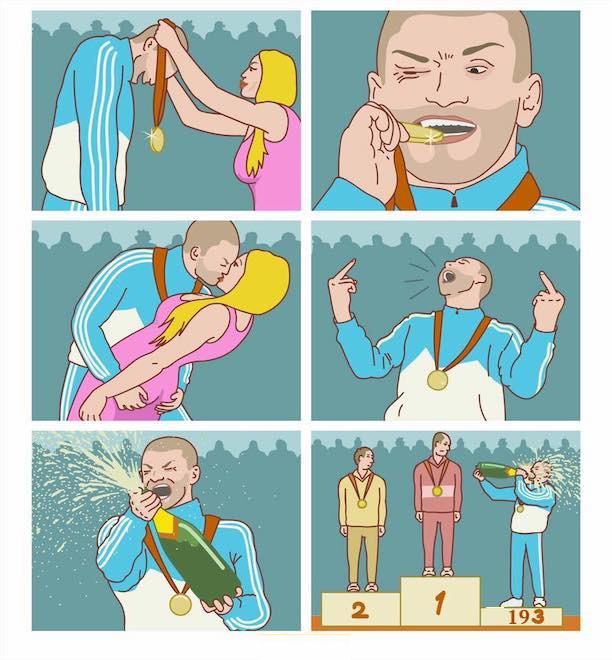

193 место из 500 участников, простое решение на CatBoost, многоклассовая классификация.

# Описание задачи

Сообщества ВКонтакте могут принадлежать одной из нескольких заранее заданных категорий, среди спортивных сообществ есть достаточно сильное разделение по тематикам! Одни и те же авторы могут писать только об одном виде спорта или сразу о большом количестве. 

По заданному набору постов необходимо определить тематику — какой именно вид спорта обсуждается в выбранном сообществе.

Список доступных категорий:

1.  athletics
2.  autosport
3.  basketball
4.  boardgames
5.  esport
6.  extreme
7.  football
8.  hockey
9.  martial_arts
10.  motosport
11.  tennis
12.  volleyball
13.  winter_sport

Нестандартная метрика:

-   За каждый правильный ответ вы получите +1.
-   За каждый неправильный ответ вы получите −1.

Можно отправлять решения, в которых категория отмечена не для каждого сообщества.

[https://cups.online/ru/tasks/1417](https://cups.online/ru/tasks/1417)
